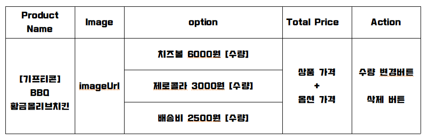

# spring-gift-enhancement
# <step3 과제>

< 시행  착오>
- 문제 )
이런 형식으로 위시리스트에 표시하고 싶었는데 테이블 생성시  
특정 테이블 열만 추가하고 이런것들을 하지 못해서 실패했습니다.
그래서 다른 방식을 선택했습니다

- 해결)  이 문제를 해결하기 위해서 각 옵션을 위시리스트로 추가할때 ,
테이블 열은 생성하지 않고 한칸에 작성하는 방식을 채택했습니다.

- 문제) 
상품의 수량과 옵션의 수량사이에서의 혼동이 생겼습니다.

-  해결)   
위시리스트에서 상품의 수량을 체크하는것을
없애고 , 상품 자기자신을 옵션으로 추가해서 옵션에서 상품의 수량을 
변경할수 있도록 설정했습니다.

